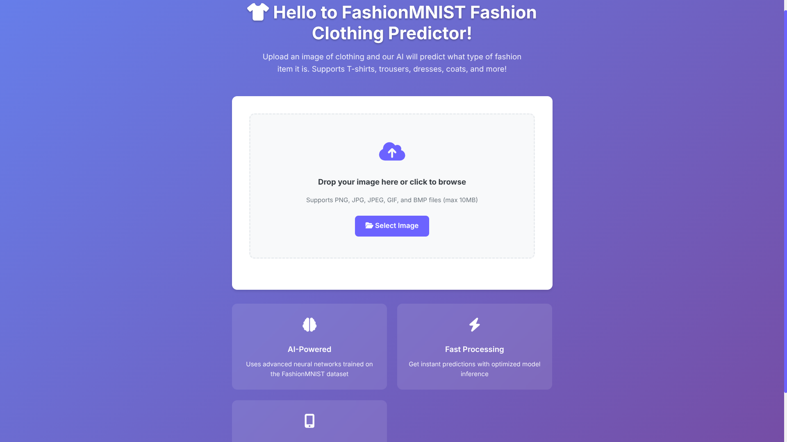
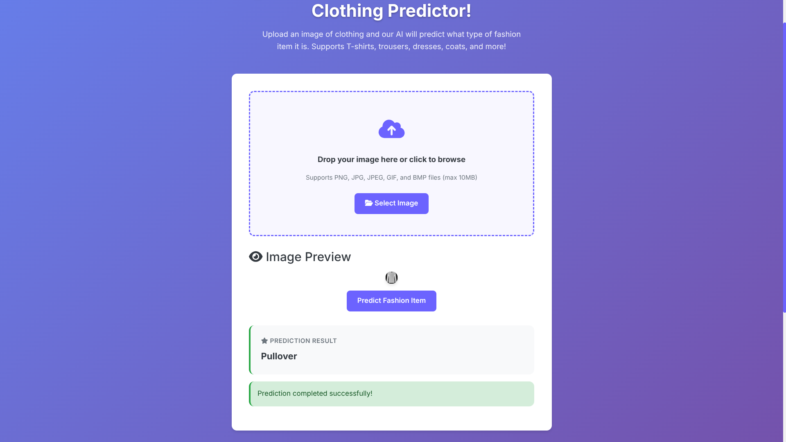

<p align="center">
  
  
  
  
  
</p>

# FashionMNIST Dataset deployed model
> **Note**: This project is *not* intended to replicate results on the official FashionMNIST benchmark. Instead, it's a hands-on exploration of building, modularizing, and deploying a deep learning model using best practices, with a focus on backend MLOps workflows. (Frontend was auto-generated via Replit and not the main focus.)
---
## Why did I create this?
As someone passionate about DevOps, MLOps, and Data Science, I’ve always understood the theoretical workflow of putting a model into production — but I’d never fully implemented one myself. This project was my opportunity to take the FashionMNIST dataset, train a model, modularize the codebase, and deploy the system end-to-end.

---
## Project Overview
The concept is simple:<br>you upload an image (from the FashionMNIST Dataset), the image gets preprocessed, and then the model performs inference on it to predict the corresponding fashion item.
### Tech stack
I used:
- **PyTorch**: Model class creation, Training, saving (TorchScript), and inference.
- **FastAPI**: High-performance web framework used for model Deployment
- **dotenv**: For managing environment variables
- **torchvision**: To download the FashionMNIST Dataset
- **argparse**: For command line argument parsing
- **Python YAML**: to handle configuration files
- **Pillow**: To handle images
- **torchmetrics**: To use metrics like Accuracy, F1-Score, Precision, and Recall
- **matplotlib**: Visualization and debugging
- **tqdm**: Used for progress during training
- **TensorBoard**: Model Training Logging (for train and test loss and accuracy)
- **Docker**: Project Containarization for reproducibility.

---

## Business Value

While the **FashionMNIST dataset** itself doesn't carry direct commercial value, the **project structure and deployment process absolutely do**.

This project demonstrates:

* A **production-ready MLOps mindset**
* Lightweight, portable, and reproducible pipelines
* Best practices in **model deployment** using tools like FastAPI and TorchScript
* Real-world patterns for **serving machine learning models** efficiently and reliably

Even though the problem is simple, the **architecture and workflow** reflect what you'd expect in scalable AI systems, making this a valuable learning and showcase piece for any business aiming to operationalize machine learning.

---
## How to install and run the project
To clone and run the project locally:
```bash
$ git clone github.com/MarwanMohammed2500/FashionMNIST_Modular_Deployed
$ cd FashionMNIST_Modular_Deployed
$ pip install -r requirements.txt
```
After you've installed all the dependencies and everything is ready, simply run (On Mac/Linux):
```bash
$ python3 run_server.py
```
Or, for a Windows PC:
```bash
python run_server.py
```

---
## Project Structure
```
FashionMNIST_Modular_Deployed/
├── app/                   # Preprocessing logic
├── modular_app/           # Modular training/inference components
│   ├── dataloader.py      # Where the data gets loaded, turned into `Tensor` objects, and then into `DataLoader` objects for proper PyTorch data handling
│   ├── inference.py       # Where inference logic lives
│   ├── metrics.py         # Initializing metrics and a simple, custom-made `classification_report`
│   ├── model.py           # Where the model class lives (Later, if I create more models, I'll add 3 sub-dirs, `deployment_model`, `previously_deployed`, and `in_test`)
│   ├── plot.py            # Where plotting functions live.
│   ├── preproc.py         # Where Preprocessing logic is.
│   ├── train.py           # Where the training function lives.
│   ├── trainer.py         # Full training pipeline.
│   └── utils.py           # Utility functions.
├── models/                # TorchScript models
├── static/                # Frontend assets (JS/CSS)
├── templates/             # HTML frontend
├── .env                   # Environment variables
├── main.py                # FastAPI app logic
├── run_server.py          # Starts the FastAPI server
├── requirements.txt       # Python dependencies
├── train_config.yaml      # Training configuration
├── test_config.yaml       # Inference configuration
├── FashionMNIST_Full.ipynb # Exploration and code modularization
└── LICENSE
```
### Running the modularized version
You can simply go to `modular_app`:
```bash
$ cd modular_app
```
Then, to train the model:
```bash
$ python3 trainer.py --config ../train_config.yaml
```
Or to run inference:
```bash
$ python3 inference.py --image_path image_path --config ../test_config.yaml
```
You can modify `train_config.yaml` and `test_config.yaml` to whatever you'd like. I just made it easier to change variables and control some hyperparameters.

---
## About the Model
The model is saved as a TorchScript model (instead of saving the `state_dict` of the model), which offers plenty of benefits over saving the `state_dict`:
- It offers better portability (You can deploy the model on a C++ server or a .NET server, embedded device, even Python environments without the headache of redefining the model class)
- No need to redefine the model class for inference.
- Easier deployments with lightweight dependencies.

---
## How to use the Web app
Simple, you can download any image of the dataset through this [Kaggle dataset page](https://www.kaggle.com/datasets/andhikawb/fashion-mnist-png)<br>
Then, just run the server, upload the image, and let the magic take place

---
## Challenges I faced
Although I had some experience with Flask, this was my first time using FastAPI. I encountered a few conceptual and implementation differences, but with some quick research and experimentation, I was able to adapt quickly.

During model training, I also spent some time tuning the learning rate, optimizer, and number of epochs — not a major challenge, but a necessary part of the process.

---
## Upcoming Improvements
As of July 17th, 2025, the app is not being monitored. Soon I'll be adding:
- Monitoring and Logging
- Further polishing and performance improvements
I might also add a simple CI/CD Pipeline, but that's way after the Docker update.

---
## Dockerhub Repo
You can check the image repo from Dockerhub [here](https://hub.docker.com/r/marwanmohammed2500/deep-learning-deployment)

---
## License
This project is licensed under the MIT License. For more details, read `LICENSE`

---
## Contributions & Contact
Feel free to contribute however you like. Just fork the repository and don't forget to ⭐ it!

If you'd like to connect or chat, feel free to reach out via Email or LinkedIn. I'm always happy to talk!

---
# Screenshots from the app
### Main Page:


### Inference:

